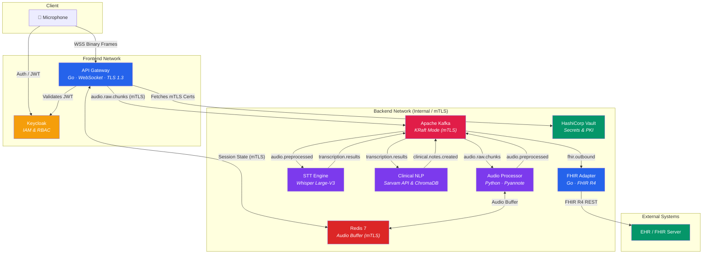

# Svaani Platform

[](LICENSE)
[](docs/security.md)
[](docs/security.md)
[](#)

**Enterprise-Grade, HIPAA-Compliant Medical Speech-to-Text & EHR Integration Platform**

Svaani is a state-of-the-art, real-time clinical documentation system designed for modern healthcare environments. It captures doctor–patient conversations with high-fidelity, performs multi-speaker diarization, generates structured SOAP notes using specialized medical AI models, and pushes the final records seamlessly to Electronic Health Record (EHR) systems via the FHIR R4 standard. 

Engineered for extreme reliability, the platform targets Tier-1 Production standards, processing heavy workloads via a distributed microservices architecture. It features full CI/CD pipelines with comprehensive security scanning, Kubernetes Helm charts for scalable orchestration, enterprise-grade Keycloak RBAC, HashiCorp Vault for secrets management, and strict zero-trust mTLS enforcement across all internal communications, all while enforcing strict zero-retention policies.

> ⚠️ **MISSION CRITICAL & PHI ALERT:** This software processes Protected Health Information (PHI). Production deployments are strictly governed by HIPAA (US), DPDPA (India), and other global privacy laws. Refer to the comprehensive [Security Documentation](docs/security.md) for enforcement guidelines.

---

## Enterprise Production Capabilities

The platform has been upgraded to a 10/10 Tier-1 production level with the following architectural enhancements:

- **Advanced Observability**: Full OpenTelemetry distributed tracing and a Prometheus/Grafana stack located in `deploy/observability`. Enterprise structured JSON logging via `structlog` is enabled across all Python microservices.
- **Kubernetes Orchestration & CD**: Production-ready Helm charts (`deploy/helm/`) featuring Istio mTLS and dynamic HashiCorp Vault sidecar injection. Automated CD pipeline (`cd.yml`) deploys all services to a staging namespace on merge to `main`.
- **Robust CI & Security**: Automated GitHub Actions pipelines incorporating Trivy and gosec security scanning, alongside a strict 70% test coverage gate. CI matrix optimally handles both Go and Python workflows.
- **Database Migrations**: Versioned up/down SQL scripts inside `migrations/` ensuring safe schema rollbacks.
- **Medical AI Benchmarking & QA**: Comprehensive validation suites for WER and Clinical Entity Evaluation. Deep QA folder (`tests/qa/`) with automated load testing (Locust), chaos engineering (Kafka consumer DLQ routing), and E2E mock pipelines.
- **Compliance & Privacy**: Real Presidio PII Redactor fully integrated for PHI stripping. Dedicated Patient Consent Module (`shared/go/pkg/consent`) and automated Vault key rotation scripts for strict lifecycle management.

---

## System Architecture



### Data Flow

| Stage | Kafka Topic | Service | Technology |
|-------|-------------|---------|------------|
| 1. Ingest | `audio.raw.chunks` | API Gateway | Go, WebSocket, TLS 1.3, Global Redis rate limiting (100 msg/sec) |
| 2. Preprocess | `audio.preprocessed` | Audio Processor | Python, pyannote (500ms chunks to 10s windows, O(1) role hash map) |
| 3. Transcribe | `transcription.results` | STT Engine | Python, OpenAI Whisper Large-V3 w/ LoRA (IndicTrans2/IndicXlit) |
| 4. Generate Notes | `clinical.notes.created` | Clinical NLP | Python, Multi-Agent (Sarvam API with Tenacity retries), ChromaDB (BGE-m3 with `CHROMA_PERSIST_DIR` for PersistentVolumes) |
| 5. Push to EHR | `fhir.outbound` | FHIR Adapter | Go, FHIR R4, Exp Backoff & DLQ |

---

## Prerequisites

| Tool | Version | Purpose |
|------|---------|---------|
| **Go** | 1.22+ | API Gateway, FHIR Adapter |
| **Python** | 3.11+ | Audio Processor, STT Engine, Clinical NLP |
| **Docker** | 24+ | Containerized deployment |
| **Docker Compose** | v2.20+ | Service orchestration |
| **CUDA Toolkit** | 12.x | GPU acceleration for ML models |
| **NVIDIA Container Toolkit** | Latest | GPU passthrough to Docker |
| **mkcert** | Latest | TLS certificate generation (dev) |
| **protoc** | 3.x | Protobuf code generation |
| **HashiCorp Vault** | 1.15+ | Secrets and dynamic certificate management |
| **Keycloak** | 22+ | Identity, access management, and RBAC |
| **Kubernetes / Helm** | 1.28+ | Production orchestration and deployment |

### GPU Requirements

| Service | VRAM Required | Notes |
|---------|--------------|-------|
| Audio Processor (pyannote) | ~2 GB | Speaker diarization |
| STT Engine (Whisper Large-V3 + LoRA) | ~12 GB | Speech recognition (Indic Support) |
| Clinical NLP (ChromaDB + BGE-m3) | ~4 GB | RAG retrieval embeddings (LLM handled via API) |

> **Minimum**: NVIDIA GPU with 16 GB VRAM
> **Recommended**: 24 GB VRAM (e.g., RTX 3090, RTX 4090) for running all local services concurrently.

---

## Quick Start

```bash
# 1. Clone the repository
git clone https://github.com/svaani/svaani.git
cd svaani

# 2. Configure environment
cp .env.example .env
# Edit .env with your HuggingFace token and credentials

# 3. One-command setup (generates certs, starts infra, creates topics)
make setup

# 4. Start the full stack
make up

# 5. Verify services are running
make ps
```

### Verify the system

```bash
# Check API Gateway health
curl -k https://localhost:8443/health

# View Kafka topics
open http://localhost:8080

# Check Redis
redis-cli -a "${REDIS_PASSWORD}" ping
```

---

## Project Structure

```
svaani/
├── .github/                        # GitHub Actions CI/CD & Security Scanning
├── certs/                          # TLS certificates (gitignored except .gitkeep)
├── deploy/
│   ├── docker-compose.yml          # Full development stack
│   ├── docker-compose.infra.yml    # Infrastructure only (Kafka, Redis)
│   ├── helm/                       # Kubernetes Helm charts (Istio + Vault injection)
│   └── observability/              # OpenTelemetry, Prometheus, and Grafana stack
├── docs/
│   ├── architecture.md             # Architecture decision records
│   ├── security.md                 # Security & compliance documentation
│   ├── api.md                      # API reference
│   ├── kubernetes.md               # Kubernetes deployment & Helm guide
│   └── observability.md            # Distributed tracing & metrics guide
├── proto/
│   └── svaani/v1/
│       ├── audio.proto             # Audio ingestion message definitions
│       ├── transcription.proto     # Transcription & SOAP note definitions
│       └── fhir.proto              # FHIR push request/response definitions
├── scripts/
│   ├── create-kafka-topics.sh      # Kafka topic provisioning
│   └── generate-certs.sh           # TLS certificate generation
├── migrations/                     # SQL database migrations for persistent stores
├── services/
│   ├── api-gateway/                # Go — WebSocket ingestion + REST API (100 msg/sec rate limit)
│   ├── audio-processor/            # Python — 500ms chunking into 10s windows, O(1) hash map speaker roles, Pyannote
│   ├── stt-engine/                 # Python — CUDA-accelerated STT Engine (DLQ routing & explicit error handling)
│   ├── clinical-nlp/               # Python — Multi-stage production Dockerfile, Sarvam API + ChromaDB (BGE-m3)
│   └── fhir-adapter/               # Go — FHIR R4 EHR integration (Backoff & DLQ)
├── shared/
│   └── go/pkg/consent/             # Patient Consent Module & Vault Key Rotation
├── tests/
│   ├── clinical-nlp/               # Clinical NLP unit tests with monkeypatching
│   └── qa/                         # Comprehensive QA suite
│       ├── chaos/                  # Chaos engineering (e.g., Kafka failure & DLQ tests)
│       ├── load/                   # Load testing (e.g., Locust WebSocket audio-streaming)
│       └── data_generator/         # Test data generation tools
├── .env.example                    # Environment variable template
├── .gitignore                      # Comprehensive gitignore (ignores service results)
├── Makefile                        # Build, test, and deployment automation
└── README.md                       # This file
```

---

## Development Workflow

### Available Make Targets

```bash
make help              # Show all available targets
make setup             # First-time setup (certs + infra + topics)
make infra-up          # Start only infrastructure
make infra-down        # Stop infrastructure
make up                # Build and start everything
make down              # Stop everything and remove volumes
make topics            # Create Kafka topics (idempotent)
make certs             # Generate TLS dev certificates
make build             # Build all Go binaries
make test              # Run all tests
make lint              # Run all linters
make proto             # Generate protobuf Go code
make clean             # Remove build artifacts and caches
```

### Running Individual Services Locally

```bash
# Start infrastructure only
make infra-up

# Run the API Gateway locally (requires Go)
cd services/api-gateway
go run ./cmd/server

# Run the STT Engine locally (requires Python + CUDA)
cd services/stt-engine
python -m venv .venv && source .venv/bin/activate
pip install -r requirements.txt
python -m stt_engine.main
```

### Protobuf Workflow

```bash
# Edit proto files in proto/svaani/v1/
# Then regenerate Go code:
make proto

# Generated code appears in shared/gen/svaani/v1/
```

---

## Security Considerations

This system is designed for HIPAA and DPDPA compliance:

- **Encryption at rest**: AES-256-GCM for all audio data and clinical notes
- **Encryption in transit**: TLS 1.3 for all inter-service communication
- **Zero retention**: Audio data is deleted after transcription; configurable retention
- **PII redaction**: Microsoft Presidio (NER & Anonymizer) for automated PHI stripping
- **Audit logging**: All data access events are published to `audit.events` Kafka topic
- **Network segmentation**: Backend services are on an internal-only Docker network

For full security documentation, see [docs/security.md](docs/security.md).

---

## Contributing

1. Fork the repository
2. Create a feature branch (`git checkout -b feat/my-feature`)
3. Commit with conventional commits (`git commit -m 'feat: add new feature'`)
4. Push to the branch (`git push origin feat/my-feature`)
5. Open a Pull Request

---

## License

This project is proprietary software. All rights reserved.

See [LICENSE](LICENSE) for details.
