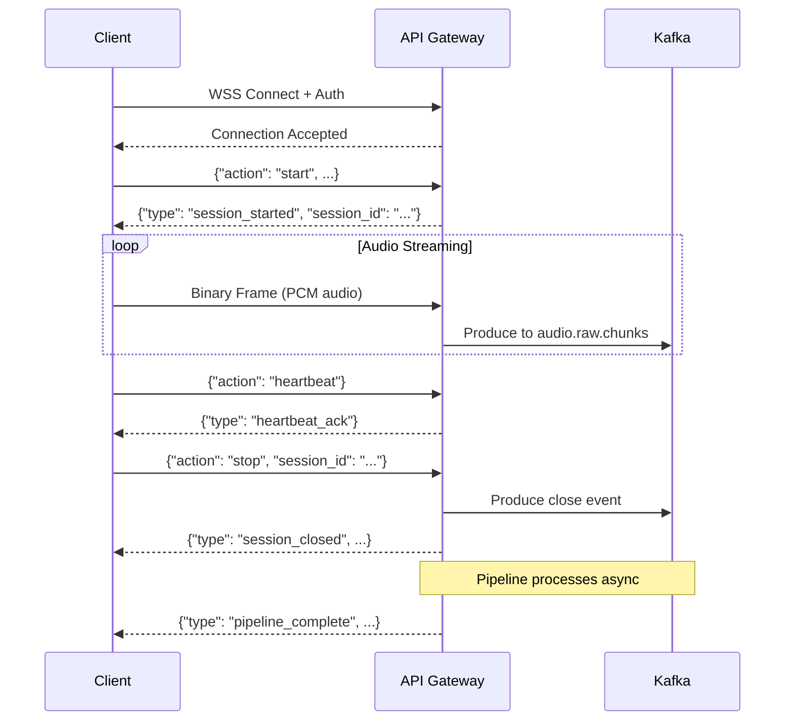

# API Documentation

This document describes the public API surface of the Svaani API Gateway.

**Base URL**: `https://localhost:8443` (development)

> All endpoints require TLS 1.3. Self-signed certificates are used in development (see `make certs`).

---

## Table of Contents

- [Authentication](#authentication)
- [WebSocket — Audio Streaming](#websocket--audio-streaming)
- [REST — Health Check](#rest--health-check)
- [REST — Session Management](#rest--session-management)
- [Error Handling](#error-handling)
- [Rate Limiting](#rate-limiting)

---

## Authentication

All requests must include one of the following authentication methods:

| Method | Header / Param | Example |
|--------|---------------|---------|
| API Key (header) | `X-API-Key` | `X-API-Key: sk_live_abc123...` |
| API Key (query) | `?api_key=` | `?api_key=sk_live_abc123...` |
| Bearer Token | `Authorization` | `Authorization: Bearer eyJhbG...` |

**API Key** authentication is recommended for WebSocket connections where custom headers may not be supported by all clients.

---

## WebSocket — Audio Streaming

### Endpoint

```
wss://host:8443/ws/audio
```

### Connection

```bash
# Using websocat (for testing)
websocat -k "wss://localhost:8443/ws/audio?api_key=your_api_key"

# Using wscat
wscat -c "wss://localhost:8443/ws/audio" \
  -H "X-API-Key: your_api_key" \
  --no-check
```

### Protocol

The WebSocket endpoint accepts two types of frames:

#### 1. Control Messages (Text Frames — JSON)

Control messages manage the session lifecycle.

**Start Session**
```json
{
  "action": "start",
  "session_id": "optional-client-provided-uuid",
  "patient_id": "patient_fhir_id",
  "practitioner_id": "practitioner_fhir_id",
  "encounter_id": "encounter_fhir_id",
  "metadata": {
    "device": "microphone_model",
    "location": "exam_room_3"
  }
}
```

**Response:**
```json
{
  "type": "session_started",
  "session_id": "01HXYZ-generated-or-provided",
  "status": "active",
  "timestamp": "2024-12-15T10:30:00Z"
}
```

**Stop Session**
```json
{
  "action": "stop",
  "session_id": "01HXYZ..."
}
```

**Response:**
```json
{
  "type": "session_closed",
  "session_id": "01HXYZ...",
  "status": "closed",
  "duration_ms": 345000,
  "chunks_received": 69,
  "timestamp": "2024-12-15T10:35:45Z"
}
```

**Heartbeat**
```json
{
  "action": "heartbeat",
  "session_id": "01HXYZ..."
}
```

**Response:**
```json
{
  "type": "heartbeat_ack",
  "session_id": "01HXYZ...",
  "timestamp": "2024-12-15T10:32:00Z"
}
```

#### 2. Audio Data (Binary Frames)

After a session is started, send raw audio as binary WebSocket frames.

**Audio Format Requirements:**

| Parameter | Value |
|-----------|-------|
| Encoding | PCM (signed 16-bit little-endian) |
| Sample Rate | 16,000 Hz |
| Channels | 1 (mono) |
| Bit Depth | 16-bit |
| Frame Size | 5 seconds recommended (160,000 bytes) |
| Max Frame Size | 10 seconds (320,000 bytes) |

**Example (Python client):**
```python
import asyncio
import websockets
import json
import struct

async def stream_audio(audio_file_path: str):
    uri = "wss://localhost:8443/ws/audio?api_key=your_api_key"
    
    async with websockets.connect(uri, ssl=True) as ws:
        # Start session
        await ws.send(json.dumps({
            "action": "start",
            "patient_id": "patient-123",
            "practitioner_id": "dr-smith-456",
            "encounter_id": "encounter-789"
        }))
        
        response = json.loads(await ws.recv())
        session_id = response["session_id"]
        print(f"Session started: {session_id}")
        
        # Stream audio in 5-second chunks
        chunk_size = 16000 * 2 * 5  # 5 seconds of 16kHz 16-bit mono
        
        with open(audio_file_path, "rb") as f:
            while chunk := f.read(chunk_size):
                await ws.send(chunk)
                await asyncio.sleep(0.1)  # Small delay between chunks
        
        # Close session
        await ws.send(json.dumps({
            "action": "stop",
            "session_id": session_id
        }))
        
        response = json.loads(await ws.recv())
        print(f"Session closed: {response}")

asyncio.run(stream_audio("recording.pcm"))
```

#### 3. Server-Sent Events (Text Frames from Server)

The server may send progress updates during processing:

**Transcription Progress**
```json
{
  "type": "transcription_progress",
  "session_id": "01HXYZ...",
  "chunks_processed": 15,
  "chunks_total": 69
}
```

**Pipeline Complete**
```json
{
  "type": "pipeline_complete",
  "session_id": "01HXYZ...",
  "soap_note_available": true,
  "fhir_push_status": "success",
  "timestamp": "2024-12-15T10:37:00Z"
}
```

**Error**
```json
{
  "type": "error",
  "session_id": "01HXYZ...",
  "code": "TRANSCRIPTION_FAILED",
  "message": "STT engine timed out after 30s",
  "timestamp": "2024-12-15T10:36:00Z"
}
```

### Connection Lifecycle



---

## REST — Health Check

### `GET /health`

Returns the health status of the API Gateway and its dependencies.

**Authentication:** Not required.

**Request:**
```bash
curl -k https://localhost:8443/health
```

**Response (200 OK):**
```json
{
  "status": "healthy",
  "version": "0.1.0",
  "uptime_seconds": 3600,
  "dependencies": {
    "kafka": {
      "status": "connected",
      "broker_count": 1
    },
    "redis": {
      "status": "connected",
      "latency_ms": 1.2
    }
  },
  "timestamp": "2024-12-15T10:30:00Z"
}
```

**Response (503 Service Unavailable):**
```json
{
  "status": "degraded",
  "version": "0.1.0",
  "uptime_seconds": 3600,
  "dependencies": {
    "kafka": {
      "status": "disconnected",
      "error": "connection refused"
    },
    "redis": {
      "status": "connected",
      "latency_ms": 1.2
    }
  },
  "timestamp": "2024-12-15T10:30:00Z"
}
```

---

## REST — Session Management

### `GET /api/v1/sessions/:id`

Retrieve the current status and metadata of a recording session.

**Authentication:** Required.

**Request:**
```bash
curl -k -H "X-API-Key: your_api_key" \
  https://localhost:8443/api/v1/sessions/01HXYZ...
```

**Response (200 OK):**
```json
{
  "session_id": "01HXYZ...",
  "patient_id": "patient-123",
  "practitioner_id": "dr-smith-456",
  "encounter_id": "encounter-789",
  "status": "active",
  "started_at": "2024-12-15T10:30:00Z",
  "ended_at": null,
  "duration_ms": null,
  "chunks_received": 42,
  "pipeline_status": {
    "audio_processing": "complete",
    "transcription": "in_progress",
    "clinical_nlp": "pending",
    "fhir_push": "pending"
  },
  "metadata": {
    "device": "microphone_model",
    "location": "exam_room_3"
  }
}
```

**Response (404 Not Found):**
```json
{
  "error": {
    "code": "SESSION_NOT_FOUND",
    "message": "No session found with ID '01HXYZ...'"
  }
}
```

### `POST /api/v1/sessions/:id/close`

Manually close an active recording session and trigger downstream processing.

**Authentication:** Required.

**Request:**
```bash
curl -k -X POST -H "X-API-Key: your_api_key" \
  https://localhost:8443/api/v1/sessions/01HXYZ.../close
```

**Response (200 OK):**
```json
{
  "session_id": "01HXYZ...",
  "status": "closed",
  "ended_at": "2024-12-15T10:35:45Z",
  "duration_ms": 345000,
  "chunks_received": 69,
  "message": "Session closed. Pipeline processing initiated."
}
```

**Response (409 Conflict):**
```json
{
  "error": {
    "code": "SESSION_ALREADY_CLOSED",
    "message": "Session '01HXYZ...' is already closed."
  }
}
```

---

## Error Handling

### Error Response Format

All error responses follow a consistent structure:

```json
{
  "error": {
    "code": "ERROR_CODE",
    "message": "Human-readable error description",
    "details": {}
  }
}
```

### Error Codes

| Code | HTTP Status | Description |
|------|-------------|-------------|
| `UNAUTHORIZED` | 401 | Missing or invalid authentication credentials |
| `FORBIDDEN` | 403 | Valid credentials but insufficient permissions |
| `SESSION_NOT_FOUND` | 404 | Session ID does not exist |
| `SESSION_ALREADY_CLOSED` | 409 | Attempting to close an already-closed session |
| `RATE_LIMITED` | 429 | Too many requests; retry after backoff |
| `INVALID_AUDIO_FORMAT` | 400 | Audio data does not match expected PCM format |
| `PAYLOAD_TOO_LARGE` | 413 | Audio frame exceeds maximum size (320KB) |
| `INTERNAL_ERROR` | 500 | Unexpected server error |
| `SERVICE_UNAVAILABLE` | 503 | Dependency (Kafka/Redis) is unreachable |
| `TRANSCRIPTION_FAILED` | 500 | STT engine failed to process audio |
| `NLP_FAILED` | 500 | Clinical NLP failed to generate SOAP note |
| `FHIR_PUSH_FAILED` | 502 | EHR system rejected the FHIR resource |

---

## Rate Limiting

Rate limits are enforced per API key using a sliding window algorithm backed by Redis.

| Endpoint | Limit | Window | Header |
|----------|-------|--------|--------|
| `wss://.../ws/audio` (connect) | 10 connections | 1 minute | `X-RateLimit-Limit` |
| `wss://.../ws/audio` (messages) | 100 messages | 1 second | `N/A` (Connection dropped) |
| `GET /api/v1/sessions/:id` | 100 requests | 1 minute | `X-RateLimit-Limit` |
| `POST /api/v1/sessions/:id/close` | 20 requests | 1 minute | `X-RateLimit-Limit` |

### Rate Limit Headers

All responses include rate limit headers:

```
X-RateLimit-Limit: 100
X-RateLimit-Remaining: 95
X-RateLimit-Reset: 1702641600
```

When rate-limited, the server returns:

```
HTTP/1.1 429 Too Many Requests
Retry-After: 30

{
  "error": {
    "code": "RATE_LIMITED",
    "message": "Rate limit exceeded. Retry after 30 seconds."
  }
}
```
