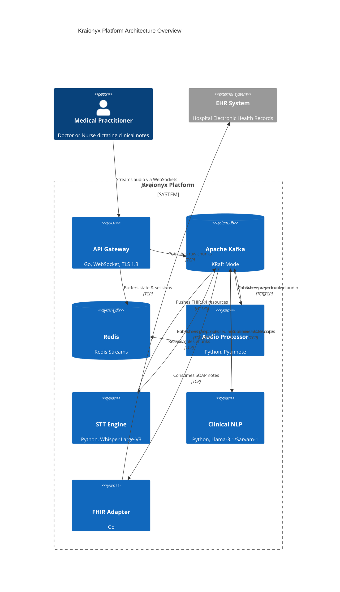

# Architecture Decision Records

This document captures the key architectural decisions made for the Kraionyx medical STT & EHR integration system, including context, rationale, and trade-offs.

## High-Level System Overview

---

## ADR-001: Dual-Language Stack (Go + Python)

**Status:** Accepted
**Date:** 2024-12

### Context

Kraionyx requires both high-performance network services (WebSocket ingestion, FHIR API integration) and GPU-accelerated ML inference (speech recognition, speaker diarization, clinical NLP). No single language excels at both.

### Decision

Use **Go** for network-bound services and **Python** for ML/AI services.

| Service | Language | Rationale |
|---------|----------|-----------|
| API Gateway | Go | Low-latency WebSocket handling, efficient goroutine concurrency |
| FHIR Adapter | Go | Strong HTTP client, type safety for FHIR resource construction |
| Audio Processor | Python | Pyannote (10s buffers, O(1) role map) |
| STT Engine | Python | OpenAI Whisper Large-V3 (LoRA) + IndicTrans2/IndicXlit |
| Clinical NLP | Python | Multi-Agent Workflow (Llama-3.1-8B-Instruct/Sarvam-1) + BGE-m3 LRU |

### Consequences

- **Positive**: Each service uses the best tool for its job; ML ecosystem is Python-native.
- **Negative**: Two build toolchains, two dependency ecosystems, slightly higher onboarding friction.
- **Mitigation**: Protobuf shared definitions ensure type-safe inter-service contracts regardless of language.

---

## ADR-002: franz-go Over confluent-kafka-go

**Status:** Accepted
**Date:** 2024-12

### Context

The Go services (API Gateway, FHIR Adapter) need a Kafka client library. The two leading options are:

1. **confluent-kafka-go** — Official Confluent client; wraps librdkafka (C library) via CGO.
2. **franz-go** — Pure Go Kafka client with zero CGO dependencies.

### Decision

Use **franz-go** (`github.com/twmb/franz-go`).

### Rationale

| Factor | confluent-kafka-go | franz-go |
|--------|-------------------|----------|
| CGO dependency | Required (librdkafka) | None — pure Go |
| Cross-compilation | Complex (need C toolchain per platform) | Trivial (`GOOS=linux go build`) |
| Docker image size | ~150 MB larger (C libs) | Minimal |
| API design | C-callback style, error-prone | Idiomatic Go, context-aware |
| KRaft support | Yes | Yes (first-class) |
| Performance | Excellent | Excellent (comparable benchmarks) |
| Static linking | Difficult | Trivial |

### Consequences

- **Positive**: Simpler Docker builds (scratch/distroless base images), easier CI/CD, no CGO debugging.
- **Negative**: Smaller community; some advanced admin APIs may require shelling out to `kafka-topics.sh`.

---

## ADR-003: KRaft Mode Over Zookeeper

**Status:** Accepted
**Date:** 2024-12

### Context

Apache Kafka historically required Apache Zookeeper for metadata management. Since Kafka 3.3, KRaft (Kafka Raft) mode allows Kafka to run without Zookeeper. As of Kafka 3.7, KRaft is production-ready and Zookeeper is deprecated.

### Decision

Deploy Kafka in **KRaft combined mode** (broker + controller in a single process) for development, with the option to separate broker and controller roles in production.

### Rationale

- **Simpler operations**: One fewer service to manage, monitor, and secure.
- **Faster startup**: No Zookeeper election delay; Kafka self-bootstraps.
- **Better scaling**: KRaft handles partition metadata more efficiently at scale.
- **Future-proof**: Zookeeper support is being removed in Kafka 4.0.
- **Smaller footprint**: One container vs. two for local development.

### Consequences

- **Positive**: Reduced operational complexity, fewer containers, less configuration.
- **Negative**: Combined mode is single-node only; production requires role separation.
- **Mitigation**: `docker-compose.yml` uses combined mode; production Helm charts will use separate broker/controller roles.

---

## ADR-004: Redis Streams for Audio Buffering

**Status:** Accepted
**Date:** 2024-12

### Context

Audio chunks arrive via WebSocket and must be buffered before batch processing by the Audio Processor. Options considered:

1. **Kafka only** — Write chunks directly to Kafka and let consumers reassemble.
2. **Redis Streams** — Buffer chunks in Redis with time-ordered, session-keyed streams.
3. **S3/MinIO** — Write chunks to object storage with manifest files.

### Decision

Use **Redis Streams** as the audio chunk buffer, with Kafka for inter-service event routing.

### Rationale

| Factor | Kafka Only | Redis Streams | S3/MinIO |
|--------|-----------|---------------|----------|
| Latency | ~5 ms | <1 ms | ~50 ms |
| Session-keyed access | Awkward (one topic, filter by key) | Native (stream per session) | File listing |
| TTL / auto-expiration | No native TTL | `XTRIM` + `EXPIRE` | Lifecycle rules |
| Random access | Not supported | `XRANGE` by timestamp | GET by key |
| Chunk reassembly | Consumer-side | Server-side with `XRANGE` | Download + concat |

### Consequences

- **Positive**: Sub-millisecond access for real-time buffering; natural session isolation; automatic expiration supports zero-retention policy.
- **Negative**: Data lost if Redis restarts without AOF persistence.
- **Mitigation**: Redis configured with `appendonly yes` and periodic snapshots; Kafka retains raw events as backup.

---

## ADR-005: OpenAI Whisper Large-V3 (LoRA) Over NVIDIA Canary-Qwen

**Status:** Accepted
**Date:** 2026-06

### Context

Originally, the STT Engine utilized NVIDIA Canary-Qwen. However, to support better multi-lingual processing and achieve state-of-the-art medical accuracy, an upgrade to Whisper Large-V3 with LoRA, alongside Indic language support (IndicTrans2/IndicXlit), was necessary.

### Decision

Use **OpenAI Whisper Large-V3** with **LoRA support** for the STT Engine, alongside **IndicTrans2 and IndicXlit** for Indic language handling.

### Rationale

- **Accuracy**: Whisper Large-V3 provides state-of-the-art performance across multiple languages. LoRA enables fine-tuning specifically for medical terminology.
- **Indic Support**: Integrating IndicTrans2 and IndicXlit natively supports India's linguistic diversity.
- **Robustness**: Better native handling of specialized medical terminology and regional accents.

### Consequences

- **Positive**: Higher transcription accuracy, robust multi-lingual and Indic support, easier fine-tuning via LoRA.
- **Negative**: Increased VRAM requirements (~12 GB), necessitating larger hardware profiles.

---

## ADR-006: Agentic Workflow (Llama-3.1/Sarvam-1) & BGE-m3 RAG Over Basic RAG

**Status:** Accepted
**Date:** 2026-06

### Context

Generating SOAP notes in a single LLM pass (previously MedGemma) led to hallucinations. The initial Multi-Agent workflow using FAISS needed an upgrade to better models and more resilient caching for patient history context.

### Decision

Implement an **Agentic Workflow** using **Llama-3.1-8B-Instruct and Sarvam-1**, while upgrading the Vector DB to use **BGE-m3 embeddings with an LRU cache eviction policy**.

### Rationale

- **Multi-Agent Pipeline**: Uses top-tier 8B instruct models tailored for reasoning and Indic context.
  - *Extractor*: Extracts entities using Presidio for PHI and LLM for symptoms/vitals.
  - *Synthesizer*: Drafts the SOAP note incorporating RAG data.
  - *Verifier*: Cross-checks the draft against the original transcript.
- **BGE-m3 RAG + LRU**: Upgraded vector embeddings for better semantic retrieval across multiple languages, coupled with an LRU cache eviction policy for efficient memory management.

### Consequences

- **Positive**: Drastic reduction in hallucinations, high clinical safety, multi-lingual RAG support.
- **Negative**: Increased VRAM requirements (~24 GB) for holding Llama-3.1-8B-Instruct in memory alongside BGE-m3.

---

## ADR-007: Custom FHIR Structs Over Third-Party Libraries

**Status:** Accepted
**Date:** 2024-12

### Context

The FHIR Adapter must construct and serialize FHIR R4 resources (DocumentReference, DiagnosticReport). Options:

1. **Third-party Go FHIR libraries** (e.g., `samply/golang-fhir-models`, `google/fhir`) — Full resource models.
2. **Custom structs** — Hand-written Go structs for only the resources we need.

### Decision

Use **custom Go structs** for the specific FHIR R4 resources we produce.

### Rationale

| Factor | Third-party libs | Custom structs |
|--------|-----------------|----------------|
| Dependency weight | Heavy (~50+ generated types) | Minimal (3-5 structs) |
| API surface | Full FHIR R4 spec | Only what we use |
| Validation | Generic FHIR validation | Custom validation with clinical rules |
| JSON serialization | Standard `json` tags | Standard `json` tags |
| Maintenance | Track upstream FHIR spec changes | We control the surface |
| Compile time | Slower (large type graph) | Fast |

### Consequences

- **Positive**: Tiny dependency footprint; compile-time type safety for exactly the resources we use; easy to add custom validation (e.g., require encounter reference).
- **Negative**: Must manually update structs if FHIR spec changes affect our resources; no out-of-the-box FHIR validation.
- **Mitigation**: We only produce 2-3 resource types; FHIR R4 is stable; unit tests validate JSON output against FHIR schemas.

---

## ADR-008: Strict API Gateway Rate Limiting

**Status:** Accepted
**Date:** 2026-06

### Context

To prevent abuse and ensure stability across the distributed system, the API Gateway requires robust traffic control.

### Decision

Implement strict **100 msg/sec rate limiting** at the API Gateway level.

### Rationale

- Ensures downstream components (Kafka, Audio Processor) are not overwhelmed during traffic spikes or DoS attempts.
- Protects GPU inference resources from being bottlenecked.

### Consequences

- **Positive**: Predictable system load and improved overall stability.
- **Negative**: Hard limits may affect legitimate bulk-upload workflows if not batched correctly.

---

## ADR-009: FHIR Adapter Exponential Backoff & DLQ

**Status:** Accepted
**Date:** 2026-06

### Context

External EHR systems frequently experience downtime or rate limiting. Dropping clinical notes is unacceptable.

### Decision

Implement **Exponential Backoff** and a **Dead Letter Queue (DLQ)** in the FHIR Adapter.

### Rationale

- **Exponential Backoff**: Handles transient network/EHR availability issues without spamming the EHR API.
- **DLQ**: Provides a durable safety net for messages that permanently fail after maximum retries.

### Consequences

- **Positive**: No silent data loss; operational visibility into failing EHR pushes.
- **Negative**: Increased logic complexity in the FHIR Adapter.

---

## ADR-010: Comprehensive QA Suite

**Status:** Accepted
**Date:** 2026-06

### Context

As the platform scales and handles critical health data, standard unit tests are insufficient.

### Decision

Introduce a new `tests/qa/` suite encompassing **Load Testing** (Locust), **Chaos Engineering** (Kafka failure tests), and **Data Generation**.

### Rationale

- Ensures the platform meets high reliability and security standards.
- Validates the 100 msg/sec rate limits, DLQ recovery, and RAG resilience under stress.

---

## ADR-013: Service-Level DLQ Routing (STT Engine)

**Status:** Accepted
**Date:** 2026-06

### Context

Previously, the STT Engine silently swallowed processing or API errors, resulting in empty transcripts being pushed to downstream services (like Clinical NLP). This is a critical medical compliance issue.

### Decision

Implement explicit error handling (e.g., `TranscriptionError`) in the STT Engine's processing loop. Any failed transcriptions are routed to a dedicated Dead Letter Queue (DLQ) topic (`transcription.results.dlq`) instead of being silently ignored.

### Rationale

- Ensures that transient transcription failures (e.g., API timeouts) do not result in blank patient records.
- Enables operational visibility and replay capabilities for failed audio segments.

---

## ADR-011: Audio Processor Chunk Buffering Optimization

**Status:** Accepted
**Date:** 2026-06

### Context

Real-time audio ingestion can result in fragmented segments causing diarization instability.

### Decision

Configure the **Audio Processor** to buffer 500ms chunks into **10-second windows** for Pyannote diarization, and utilize an **O(1) hash map** for speaker roles.

### Rationale

- **10-Second Windows**: Provides sufficient context for Pyannote to accurately perform speaker diarization.
- **O(1) Hash Map**: Guarantees constant-time lookups for resolving speaker roles during continuous streams, eliminating scaling overhead for long sessions.

### Consequences

- **Positive**: Exceptional diarization accuracy and predictable low-latency speaker tracking.
- **Negative**: Introduces a fixed initial 10-second latency before the first transcript segment is emitted.

---

## ADR-012: Microsoft Presidio for PHI Redaction

**Status:** Accepted
**Date:** 2026-06

### Context

Homegrown regex and basic NER for PHI redaction lacked the scale and edge-case handling needed for strict clinical compliance.

### Decision

Implement **Microsoft Presidio** acting primarily through optimized regex behaviors and medical-specific recognizers for PHI redaction.

### Rationale

- **Enterprise-Grade**: Presidio provides a robust, proven framework for PII/PHI anonymization.
- **Configurability**: Allows fine-tuning of regex patterns and contextual thresholds tailored specifically for Indian and US clinical data structures.

### Consequences

- **Positive**: Increased confidence in HIPAA and DPDPA compliance, lower false-negative rates for PHI leakage.
- **Negative**: Requires careful tuning to avoid over-redacting valid clinical terms.
