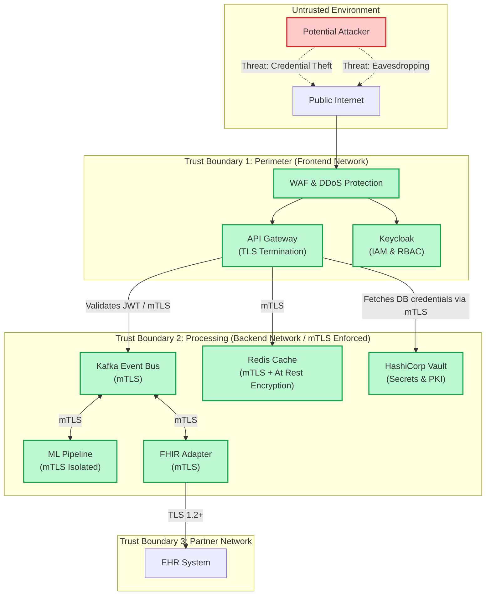
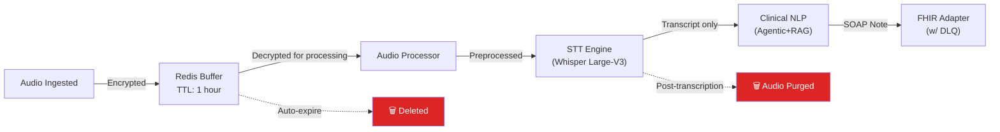
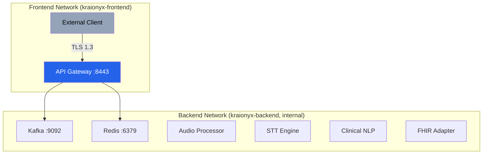

# Security & Compliance Documentation

This document defines the security controls, compliance requirements, and data protection policies for the Kraionyx medical STT & EHR integration platform.

> **Classification**: CONFIDENTIAL — Internal Use Only

---

## 1. Threat Model & Trust Boundaries

The system processes highly sensitive PHI/PII data. Our threat model assumes internal networks might be compromised, meaning defense-in-depth is required.



---

## 2. Regulatory Compliance Matrix

Kraionyx is designed to comply with the following regulations when deployed with proper organizational controls:

### HIPAA (United States)

| HIPAA Rule | Requirement | Kraionyx Control | Status |
|------------|-------------|------------------|--------|
| §164.312(a)(1) | Access Control | API key + JWT authentication; RBAC per practitioner | ✅ Implemented |
| §164.312(a)(2)(iv) | Encryption at Rest | AES-256-GCM for all PHI in Redis and Kafka | ✅ Implemented |
| §164.312(e)(1) | Encryption in Transit | TLS 1.3 on all endpoints; mTLS between services | ✅ Implemented |
| §164.312(b) | Audit Controls | All access events published to `audit.events` Kafka topic | ✅ Implemented |
| §164.312(c)(1) | Integrity Controls | HMAC signatures on clinical notes; immutable audit log | ✅ Implemented |
| §164.312(d) | Person Authentication | JWT with short-lived tokens; API key rotation support | ✅ Implemented |
| §164.308(a)(5)(ii)(B) | Log-in Monitoring | Failed authentication attempts logged and rate-limited | ✅ Implemented |
| §164.310(d)(2)(i) | Media Disposal | Zero-retention: audio deleted post-transcription; Redis TTL | ✅ Implemented |
| §164.314(a) | BAA Requirements | No PHI sent to third-party services; on-premise ML inference | ✅ By Design |

### DPDPA (India — Digital Personal Data Protection Act, 2023)

| Principle | Requirement | Kraionyx Control |
|-----------|-------------|------------------|
| Lawful Purpose | Process data only for consented clinical purposes | Session-scoped; purpose-limited pipeline |
| Data Minimization | Collect only necessary data | Audio deleted after transcription; minimal metadata |
| Storage Limitation | Don't retain data beyond purpose | Configurable TTLs; zero-retention default |
| Data Principal Rights | Right to access, correction, erasure | Session lookup API; audit trail for deletions |
| Security Safeguards | Reasonable security measures | Encryption, access control, audit logging |
| Data Breach Notification | Notify within 72 hours | Audit events enable rapid breach detection |

---

## 2. Encryption Standards

### 2.1 Encryption in Transit

| Component | Protocol | Minimum Version | Cipher Suites |
|-----------|----------|----------------|---------------|
| Client → API Gateway | TLS | 1.3 | TLS_AES_256_GCM_SHA384, TLS_CHACHA20_POLY1305_SHA256 |
| API Gateway → Kafka | mTLS | 1.3 | Same as above |
| Inter-service (Backend) | mTLS | 1.3 | Enforced via HashiCorp Vault PKI |
| FHIR Adapter → EHR | TLS | 1.2+ | Per EHR vendor requirements |

**Production TLS Configuration (Go)**:
```go
tlsConfig := &tls.Config{
    MinVersion:               tls.VersionTLS13,
    PreferServerCipherSuites: true,
    CurvePreferences: []tls.CurveID{
        tls.X25519,
        tls.CurveP256,
    },
}
```

### 2.1.1 mTLS Enforcement Policy

Kraionyx enforces strict **Zero-Trust mTLS** across all internal backend services:
1. **Dynamic Certificates**: HashiCorp Vault acts as the internal Certificate Authority (CA). Services request short-lived mTLS certificates on boot.
2. **Strict Verification**: Every service requires client certificates (`ClientAuth: tls.RequireAndVerifyClientCert`) for all inbound connections (e.g., Redis, Kafka, and any internal gRPC/HTTP endpoints).
3. **No Fallback**: PLAINTEXT connections are rejected at the network and application layers in staging and production.

### 2.2 Encryption at Rest

| Data Type | Algorithm | Key Size | Key Management |
|-----------|-----------|----------|----------------|
| Audio chunks (Redis buffer) | AES-256-GCM | 256-bit | `ENCRYPTION_KEY` env var |
| Kafka messages (PHI fields) | AES-256-GCM | 256-bit | Per-session envelope key |
| Clinical notes | AES-256-GCM | 256-bit | Derived from master key |
| RAG Patient DB (BGE-m3 Vector DB) | Filesystem encryption | Varies | Host-level (LUKS/BitLocker) |
| Redis persistence (AOF) | Filesystem encryption | Varies | Host-level (LUKS/BitLocker) |

**Envelope Encryption Flow**:
```
1. Generate random 256-bit Data Encryption Key (DEK) per session
2. Encrypt audio/PHI with DEK using AES-256-GCM
3. Encrypt DEK with Master Key (ENCRYPTION_KEY)
4. Store encrypted DEK alongside ciphertext
5. On read: decrypt DEK with Master Key, then decrypt data with DEK
```

### 2.3 Hashing & Integrity

| Purpose | Algorithm | Notes |
|---------|-----------|-------|
| Password/secret comparison | Argon2id | OWASP recommended |
| Message integrity (audit) | HMAC-SHA256 | Tamper detection on clinical notes |
| Session ID generation | UUID v7 | Time-ordered, collision-resistant |

---

## 3. Zero-Retention Policy

Kraionyx implements a zero-retention architecture for audio data:



### Retention Schedule

| Data Type | Retention Period | Mechanism | Justification |
|-----------|-----------------|-----------|---------------|
| Raw audio (Redis) | 1 hour max | Redis TTL (`EXPIRE`) | Processing buffer only |
| Raw audio (Kafka) | 24 hours | `log.retention.hours=24` | Recovery window |
| Preprocessed audio | 1 hour | Kafka topic compaction | Processing buffer only |
| Transcription text | 7 days | Kafka retention | Review window |
| SOAP notes | Indefinite (in EHR) | EHR retention policy | Clinical record |
| Audit events | 7 years | External log aggregation | HIPAA §164.530(j) |

### Deletion Verification

- Audio deletion events are logged to `audit.events` with:
  - Session ID
  - Deletion timestamp
  - Data type deleted
  - Deletion method (TTL expiry, explicit purge)
- Periodic audit scripts verify no audio data persists beyond retention windows.

---

## 4. PII/PHI Redaction

### 4.1 Redaction Pipeline

The Extractor agent within the Clinical NLP service uses Microsoft Presidio (regex behavior) for automated PII/PHI redaction before producing clinical notes:

| PHI Category | Detection Method | Redaction Action |
|-------------|-----------------|------------------|
| Patient names | NER (spaCy + custom medical NER) | Replace with `[PATIENT]` |
| Dates of birth | Regex + NER | Generalize to age |
| Phone numbers | Regex pattern matching | Replace with `[PHONE]` |
| SSN/Aadhaar | Regex pattern matching | Replace with `[ID_REDACTED]` |
| Email addresses | Regex pattern matching | Replace with `[EMAIL]` |
| Physical addresses | NER | Replace with `[ADDRESS]` |
| Medical record numbers | Regex + context heuristics | Replace with `[MRN]` |

### 4.2 Redaction Confidence

- Each redacted entity includes a confidence score.
- Entities with confidence < 0.85 are flagged for human review.
- The `redacted_transcript` field in `ClinicalNote` contains only redacted text.
- The original un-redacted transcript is **never persisted** beyond the processing pipeline.

---

## 5. Audit Logging

### 5.1 Audit Event Schema

All security-relevant events are published to the `audit.events` Kafka topic:

```json
{
  "event_id": "evt_01HXYZ...",
  "event_type": "SESSION_CREATED | DATA_ACCESSED | PHI_REDACTED | FHIR_PUSHED | AUTH_FAILED",
  "timestamp": "2024-12-15T10:30:00Z",
  "actor": {
    "type": "practitioner | system | api_key",
    "id": "pract_abc123",
    "ip_address": "192.168.1.100"
  },
  "resource": {
    "type": "audio_session | clinical_note | fhir_resource",
    "id": "sess_xyz789"
  },
  "action": "create | read | update | delete | export",
  "outcome": "success | failure",
  "details": {
    "reason": "...",
    "metadata": {}
  }
}
```

### 5.2 Events That Must Be Logged

| Event | Trigger | Severity |
|-------|---------|----------|
| Authentication success | Valid API key/JWT presented | INFO |
| Authentication failure | Invalid credentials | WARNING |
| Session created | New audio recording started | INFO |
| Audio data accessed | Any read of audio buffer | INFO |
| Transcription completed | STT output generated | INFO |
| PHI detected and redacted | PII found in transcript | INFO |
| SOAP note generated | Clinical NLP output | INFO |
| FHIR resource pushed | Data sent to EHR | INFO |
| FHIR push failed | EHR rejected resource | ERROR |
| Data deletion | Audio/session purged | INFO |
| Rate limit exceeded | Too many requests | WARNING |
| Unauthorized access attempt | Insufficient permissions | CRITICAL |

### 5.3 Audit Log Retention

- Audit events are retained for **7 years** per HIPAA §164.530(j).
- Events are forwarded from Kafka to a long-term storage system (e.g., S3 + Athena, Elasticsearch).
- Audit logs are append-only and integrity-protected with HMAC.

---

## 6. Key Management Strategy

### 6.1 Key Hierarchy

```
Master Key (ENCRYPTION_KEY)
├── Session DEK (per audio session)
│   ├── Encrypts audio chunks
│   └── Encrypts intermediate pipeline data
├── JWT Signing Key (JWT_SECRET)
│   └── Signs/verifies authentication tokens
└── API Key (API_KEY)
    └── Authenticates client connections
```

### 6.2 Key Rotation

| Key | Rotation Frequency | Method |
|-----|-------------------|--------|
| Master Key (ENCRYPTION_KEY) | 90 days | Automated via HashiCorp Vault |
| JWT_SECRET | 30 days | Keycloak automatic key rotation |
| API_KEY | On demand | Vault dynamic secret generation / revocation |
| TLS certificates | 90 days (dev), 1 year (prod) | Automated via cert-manager or ACME |
| mTLS certificates | 24 hours | Vault PKI secret engine (dynamic) |
| Session DEK | Per session | Automatically generated and destroyed |

### 6.3 Key Storage (Production)

| Environment | Key Storage | Notes |
|------------|-------------|-------|
| Development | `.env` file (gitignored) | Local only, never committed |
| Staging / Prod | **HashiCorp Vault** | Encrypted at rest, tightly integrated via Kubernetes Service Accounts |

### 6.4 Emergency Key Revocation

1. Rotate `ENCRYPTION_KEY` in secrets manager.
2. Restart all services to pick up new key.
3. Active sessions are terminated (clients must reconnect).
4. Audit event logged: `KEY_ROTATED`.
5. Old key retained in escrow for 30 days (decrypt any in-flight data).

---

## 7. Network Security

### 7.1 Docker Network Segmentation



- **Frontend network**: Only the API Gateway is exposed to external traffic.
- **Backend network**: Marked `internal: true` — no outbound internet access.
- ML services, Kafka, and Redis cannot be reached from outside the Docker network.

### 7.2 Port Exposure

| Service | Internal Port | External Port | Network |
|---------|--------------|---------------|---------|
| API Gateway | 8443 | 8443 | frontend + backend |
| Kafka | 9092 | 9094 (dev only) | backend |
| Redis | 6379 | 6379 (dev only) | backend |
| Kafka UI | 8080 | 8080 (dev only) | backend |
| Audio Processor | — | — | backend |
| STT Engine | — | — | backend |
| Clinical NLP | — | — | backend |
| FHIR Adapter | — | — | backend |

> **Production**: Only port 8443 (API Gateway) should be exposed. All dev-only ports must be removed.

---

## 8. Authentication & Authorization

### 8.1 Client Authentication & IAM

Authentication is delegated to **Keycloak**, which provides enterprise-grade Identity and Access Management (IAM):

```
Client → Keycloak: Authenticate (OAuth2 / OIDC)
Keycloak → Client: Return signed JWT
Client → API Gateway:
  Option A: Bearer Token   → Authorization: Bearer <jwt_token>
```
*Note: API keys for programmatic access are issued and rotated via HashiCorp Vault.*

### 8.2 Enterprise RBAC (Role-Based Access Control)

Keycloak enforces fine-grained RBAC mapping to hospital AD groups. Example roles include:
- `kraionyx_practitioner`: Can record audio, view own sessions, and edit own drafts.
- `kraionyx_reviewer`: Can review and finalize SOAP notes for a specific department.
- `kraionyx_admin`: System configuration and audit log access.

### 8.3 JWT Token Structure

Tokens generated by Keycloak include these roles:

```json
{
  "sub": "practitioner_id",
  "iss": "https://auth.kraionyx.io/realms/medical",
  "iat": 1702600000,
  "exp": 1702603600,
  "realm_access": {
    "roles": ["kraionyx_practitioner"]
  },
  "practitioner_id": "pract_abc123",
  "organization_id": "org_xyz789"
}
```

### 8.3 Rate Limiting

| Endpoint | Limit | Window | Action on Exceed |
|----------|-------|--------|------------------|
| WebSocket connect | 10 | 1 minute | 429 + audit event |
| WebSocket messages | 100 | 1 second | Connection dropped + audit event |
| REST API | 100 | 1 minute | 429 + exponential backoff |
| Auth failures | 5 | 5 minutes | Temporary IP block + alert |

---

## 9. Incident Response

### 9.1 Data Breach Response Plan

1. **Detection** (0-1 hour): Automated alerts from audit event anomalies.
2. **Containment** (1-4 hours): Revoke compromised keys, isolate affected services.
3. **Assessment** (4-24 hours): Determine scope of PHI exposure via audit logs.
4. **Notification** (within 72 hours): Notify affected individuals and regulators per HIPAA/DPDPA.
5. **Remediation** (1-7 days): Patch vulnerability, rotate all keys, update access controls.
6. **Post-mortem** (7-14 days): Root cause analysis, process improvements.

### 9.2 Security Contact

Report security vulnerabilities to: **security@kraionyx.io** (PGP key available on request).
